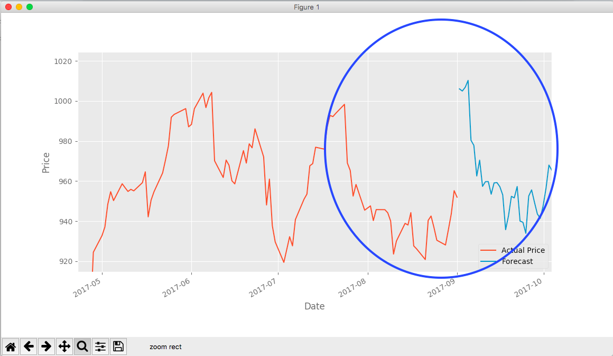

# Machine-Learning-Stock-It
Utilized Machine Learning to build a program that is able to predict stock price in the next 30 days by automatically collects available data in the market and analyzing them.

# Visualization
Please click on the file "Stock-It.ipynb" to visualize the code and result.

Accuracy: 97%

